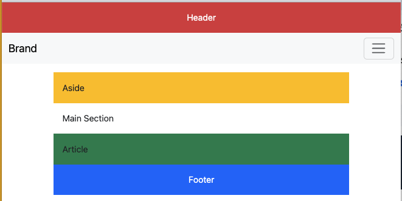
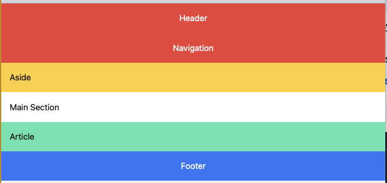
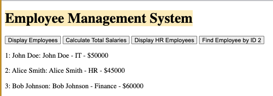

# IBM HTML, CSS, and JavaScript Projects
Projects from IBM AI Developer Professional Certificate on Coursera 

# List of Projects from templates folder
- Flask 
- HTML5

- CSS
  - inline
  - internal
  - external

- CSS Frameworks- Bootstrap
  - Bootstrap
    

  - Tailwind CSS
    
  - Flexbox
  
- JavaScript
  - Employee Management System  
    
    
  - 

